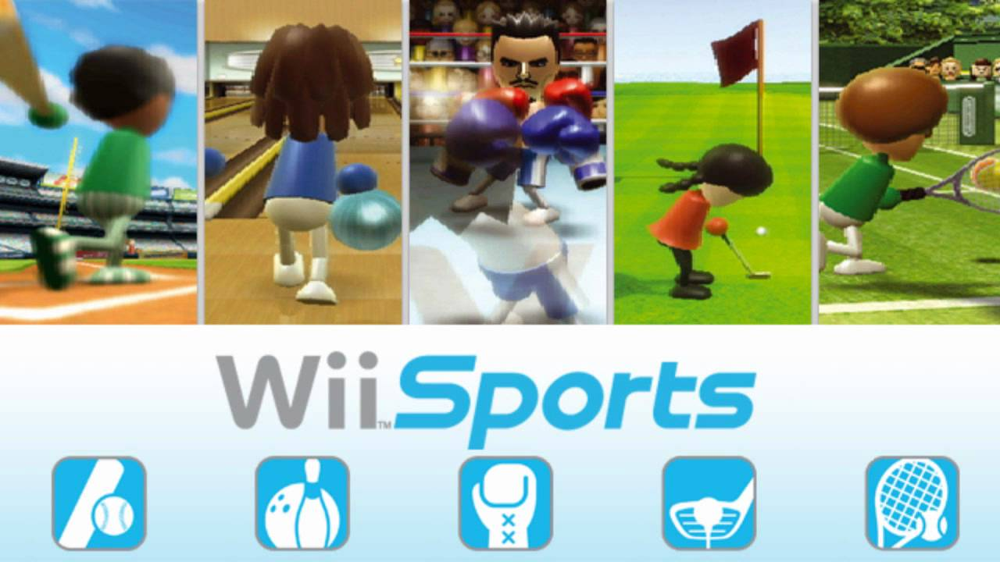

Games
=====

The Wii is a very popular Nintendo game because of it's ability to be active while playing. The controllers are wireless and require movement in order to control the game. 

**Some of the Wii's most popular games are:**

**Wii Sports**

.. _Know Your Meme: https://knowyourmeme.com/photos/1220700-mii

   Image: `Know Your Meme`_

*Wii Sports* was released in 2006 and can play up to 4 people. This games 
offers many different sports, such as tennis, bowling, golf, boxing and more! 

**Mario Kart**

.. _Amazon: https://www.amazon.com/Mario-Kart-Wii-nintendo/dp/B001GIUWX0

   Image: `Amazon`_

*Mario Kart* was released in 2008 and can play up to 12 people. This is a fun
 racing game with all of your favorite courses from previous Nintendo system, 
 plus many new, exciting courses! This game also allows the user to purchase a
 Wii Wheel to transform the remote into a steering wheel. 

**Just Dance**

.. _Walmart: https://www.walmart.com/ip/Just-Dance-2018-Ubisoft-Nintendo-Wii-887256028251/55885490

   Image: `Walmart`_

*Just Dance* is a dancing series game, with new games released every year. 
These games feature the most current popular songs and is motion-based, with 
each song having its own choreography. 

Other popular Wii games:

* Super Smash Bros.
	* Released: 2008
* The Sims 3
	* Released: 2009
* Mario & Sonic at the Olympic Games
	* Released: 2008
* Super Mario Galaxy
	* Released: 2007
* Wii Sports Resort
	* Released: 2009

