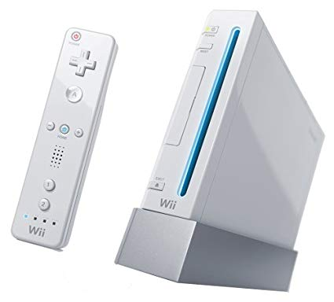
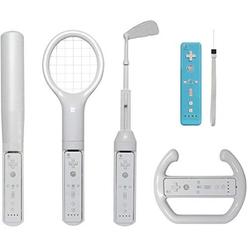

History
=======

The Nintendo Wii was first released in 2006 by the Nintendo Company in Japan. Shortly before the release of the Wii, Nintendo was being taken over by other gaming systems, such as the Xbox and PlayStation 3. However, the release of the Wii provided a low-cost gaming system that featured multiplayer "party" games and soon became a go-to party game. The Wii quickly established the largest user base of all gaming systems. 

Amazon.co.uk

Controllers
-------------------------
The Wii system has made advances in the video game world. This system features a new wireless remote. There is no longer need for buttons, the Wii remote connects to a wireless sensor attached to the console. Now movement can control the game. Nintendo has also released several accessories that are wireless and can be used by the Wii. Some of these accessories include a balance board, raching wheel, floor mat, and many more!

Wii Accessories
~~~~~~~~~~~~~~~

============= =================
Accessory     Price
============= =================
Nunchuck       $9.99
Balance Board  $38.99
Racing wheel   $14.99
Floor Mat      $19.99
============= =================

caption
