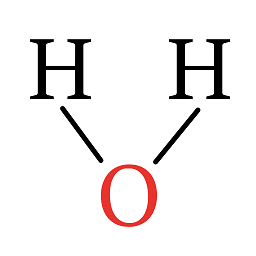

PC Platform
===========

This
is
all
one
paragraph.

This is *italics*.

These are **bold**.

* This is a list.
* This is another element of the aforementioned list.
* These words consist of the content associated with the list mentioned preiovusly.

	* It's another list!
	* It's a sublist!

		* And another sublist!

			* Sublists!

Go to `Simpson`_ like this:

.. _Simpson: http://simpson.edu

Or like this: `Google <https://www.google.com>`_

``This is monospaced text.``

Images:

   This caption on picture needs to be indented by 3 spaces and have a blank line above it.

This is a level 2 heading
-------------------------

Another heading

This is another 2
-----------------

blah

Level 3
~~~~~~~

.. code-block:: python
	:linenos:
	:caption: Sample Code

	# Sample Code
	for i in range(1, 5):
		print(i)

.. code-block:: java
	:linenos:
	:caption: Sample Java

	public static void main(String args[]) {
		System.out.println("hi");
	}

Sample Table
------------

========= =================
Fruit     Review
========= =================
Apple     3 stars
Grapes    3 stars
Pears     5 stars
========= =================

