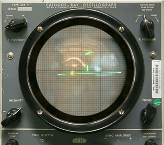
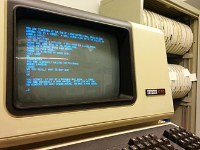
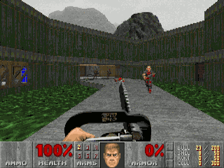
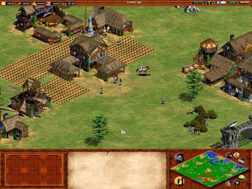
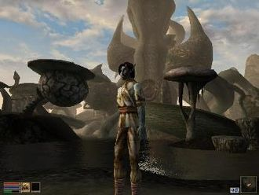
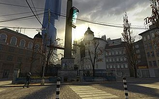
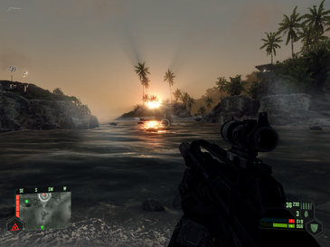
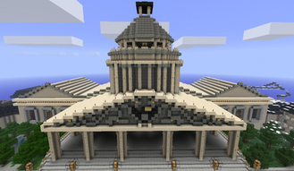
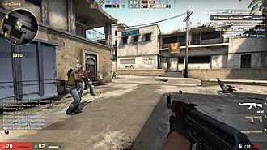
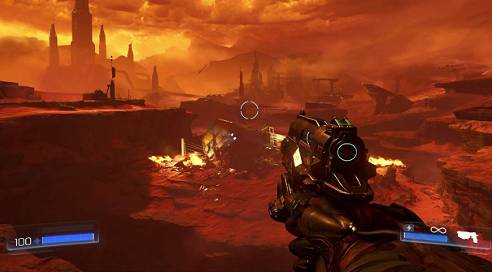

Games and History
=================

Throughout the history of PC gaming, many titles have been released that had a
profound effect on the video game industry. This section describes a few 
interesting examples of these games.

The First Game
--------------

One of the earliest examples of a video game is, "Tennis for Two" which was
designed in 1958 for the Donner Model 30 Analog Computer. The game was displayed 
on an oscilloscope and featured a simple match of tennis.

   In Tennis for Two, you play a side-view of tennis. The ball uses actual 
   trajectories supported by the Donner Model 30 Analog Computer.

Text-Adventure Games
--------------------

Eventually, other famous games such as Pong and Pacman came out. However,
some of the earliest games played on PC were text-adventure games.
Specifically, the first known example, "Colossal Cave Adventure" was made in 
1976 by Will Crowther for the PDP-10 Mainframe.

   In this game, you type in text commands to navigate a cave filled with
   treasure. You are assigned points based on what happens in the cave.

DOOM
----

Over time, as computers got more advanced, games with actual graphics were
released and popularized. One of the most influential examples in PC gaming
history was, "DOOM". Doom was released in 1993 by ID Software and ran on MS-DOS.

   Doom is a fast-paced first person shooter where you kill endless hordes
   of demons.

Age of Empires II
-----------------

Age of Empires II is a popular example of a real-time strategy game. It was
developed by Ensemble Studios and released in 1999. The game sold 2 million
copies and was considered to have shaped future generations of real-time
strategy games.

   In Age of Empires II, you build towns, gather resources and command soldiers 
   to destroy your enemies.

Morrowind
---------

Technology continued to advance and in 2002 games with much larger maps
and playable areas were being released. An example of this is, "The Elder
Scrolls III : Morrowind", The graphics for the game, as seen below, were 
impressive at the time. The success of this game helped popularize the 
Elder Scrolls franchise, further setting the scene for even more successful 
titles like Oblivion and Skyrim.

   One of my personal favorites, Morrowind is an open-world action RPG that 
   takes pace in a strange alien-like world accompanied with giant mushrooms, 
   a giant volcano, and interesting geography. There are hundreds of quests, 
   items, NPCs, and interesting things to discover.

Half-Life 2
-----------

Half-Life 2 was released in 2004, shortly after the launch of Steam. This game
had impressive graphics and introduced a revolutionary physics engine that 
opened the door to interesting possibilities. One example of this is a weapon in 
the game called, "The Gravity Gun". With the Gravity Gun, you can launch chairs, 
sawblades, and other random objects at your enemies. Half-Life 2 had a massive 
influence on the video game industry and arguably shaped its future for years to 
come.

   In Half-Life 2, you play as the theoretical physicist Gordon Freeman. After
   the events at Black Mesa in Half-Life 1, you find yourself in City 17 under
   the dystopian control of the Combine. You join forces with the resistance
   to fight through hordes of Combine Soldiers and zombies in the pursuit of
   destroying these multidimensional overlords.

Crysis
------

Crysis is a first-person shooter released in 2007 by Electronic Arts (EA). 
The graphics for this game were revolutionary at the time and it was a huge
success. Crysis featured volumetric lighting, motion blur, 
high quality textures, thousands of shaders, and other features that made the 
game look outstanding. As a consequence for the good graphics, this game
was very computationally expensive. Because of this, Crysis is commonly used 
as a benchmark to rate the quality of hardware.

   Taking place in the future, an ancient alien structure was discovered in a
   mountain in the Philippines. You must survive on an island against hordes of 
   extraterrestrials and the North Korean military.

Minecraft
---------

In 2009, Minecraft was released by Markus Persson. This would turn out to be one
of the most successful video games in history. With 154 million copies sold,
Minecraft is the second-best selling video game of all time, only being beaten 
by Tetris. 

   Minecraft is a sandbox game with an infinite procedurally generated world.
   The entire game is made of blocks you can destroy and place, allowing you
   to manipulate the world into an unlimited variety of structures and
   buildings.

CS:GO
-----

In 2012, Valve released Counter-Strike : Global Offensive (CS:GO). This game was
a major contributor for setting the scene of highly competitive multiplayer
video games, eventually leading to the popularization and creation of ESports.
As you can see in the picture below, the graphics of video games reached very
high levels around this time.

   CS:GO is a highly competitive multiplayer first person shooter. 
   Two teams of 6 players take turns playing as either the Terrorists or 
   Counter-Terrorists. The Terrorists try to blow up a site with a bomb and 
   the Counter-Terrorists try to prevent this from happening.

DOOM 2016
---------

Past this point, more and more interesting video games with new and unique
concepts continued to be released. Games such as Borderlands 2, Skyrim, 
Warframe, Farcry, GTA V, and much more. The graphics of these games continued to 
improve and new technology such as realtime ray-tracing was introduced. 
Currently, games like Fortnite and Overwatch are the most popular. 
However, I would like to end this where it began. In 2016, ID Software partnered 
with Bethesda and released a modern version of the original DOOM. If you look
at a side-by-side comparison of the two, you can easily see just how far
video game graphics and technology has come since then.

.. https://en.wikipedia.org/wiki/Tennis_for_Two
.. https://en.wikipedia.org/wiki/Colossal_Cave_Adventure
.. https://en.wikipedia.org/wiki/Doom_(1993_video_game)
.. https://en.wikipedia.org/wiki/The_Elder_Scrolls_III:_Morrowind
.. https://en.wikipedia.org/wiki/Half-Life_2
.. https://www.teepublic.com/t-shirt/3255701-tf2-logo-unofficial-merch
.. https://en.wikipedia.org/wiki/Minecraft
.. https://en.wikipedia.org/wiki/Counter-Strike:_Global_Offensive
.. https://www.youtube.com/watch?v=aXRTbLCJH40
.. https://en.wikipedia.org/wiki/Age_of_Empires_II
.. https://en.wikipedia.org/wiki/Crysis_(video_game)