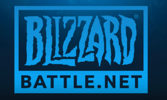

Digital Distribution Platforms
==============================

In Digital Distribution Platforms, you do not buy the actual game, but rather
you purchase a lisence for the game. Upon purchasing this lisence, the 
platform will allow you to download the game from their service.

Steam
-----

Steam is by far the most popular platform, accounting for over 75% of the 
market. Started in 2003 by the Valve Corporation, Steam has thousands of titles
for purchase. Around holidays and other events, the platform will also have
massive sales where you can buy the products for massive discounts. Steam is
estimated to have over 150 million active users. These are users who have
logged into steam within the past 90 days. There's very few games that you
can't find on Steam which are available for PC. This platform also includes a
large number of indie games through its Steam Greenlight service. 
Steam also includes a large number of exclusive titles and games made by Valve 
itself. Some popular examples of these games are.

* The Half-Life series
* Team Fortress 2
* The Counter-Strike series
* Dota 2
* Portal 2

Origin
------

Origin is the platform owned by Electronic Arts (EA) and was launched in 2005.
Origin is estimated to have about 50 million registered users. Some popular 
titles found on Origin include the following.

* The Battlefield series
* Crysis III
* The FIFA series
* The Madden NFL series
* Mass Effect 3
* Star Wars Battlefront
* Mirror's Edge

Battle.net 2.0
--------------

Blizzard Entertainment revamped their platform called, "Battle Net" in 2009. 
Unlike Steam, Battle Net only contains titles created by Blizzard Entertainment. 
Some popular examples of these titles are the following.

* World of Warcraft
* Overwatch
* The Diablo Series
* The Starcraft Series

.. Sources (including images):
.. https://en.wikipedia.org/wiki/Steam_(software)
.. https://en.wikipedia.org/wiki/Origin_(digital_distribution_software)
.. https://en.wikipedia.org/wiki/Blizzard_Entertainment
.. https://en.wikipedia.org/wiki/Battle.net