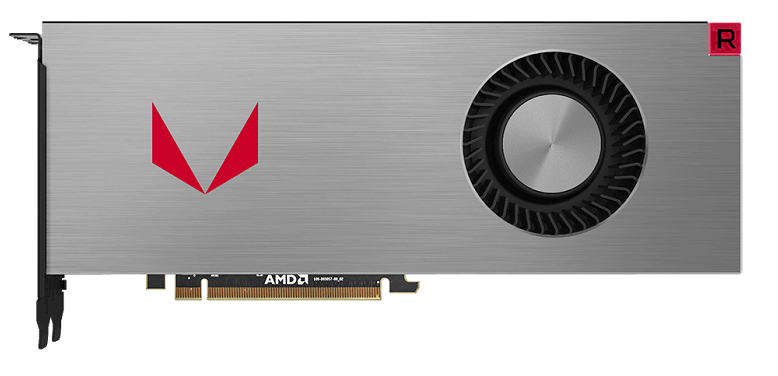

Hardware Reviews
================

The hardware of the computer is very important for PC gaming. Especially for
modern titles that have highly detailed graphics. Arguably, the two most
important and priciest pieces of hardware is the graphics card and the 
processor. This section will compare popular examples of these.

Graphics Cards
--------------

The two most popular brands for video cards / graphics cards are Nvidia and AMD.
The best cards these brands have to offer are the followin.

**NVIDIA - TITAN RTX**

   `Image from: HotHardware <https://hothardware.com/news/nvidia-titan-rtx-turing-gpu-24gb-gddr6-11-gigarays-ray-tracing>`__

**AMD - Radeon RX Vega 64**

   `Image from: OverclockersUK <https://www.overclockers.co.uk/powercolor-radeon-rx-vega-64-red-devil-8gb-hbm2-pci-express-graphics-card-gx-190-pc.html>`__

**Comparison**

========== ===== =========== ============== =========== =====
Card       Cores Memory Size Transistors    Clock Speed Price
========== ===== =========== ============== =========== =====
TITAN RTX  4608  24 GB       18,600 million 1350 MHz    $650
RX VEGA 64 4096  8 GB        12,500 million 1200 MHz    $2500
========== ===== =========== ============== =========== =====

Fun fact, the Titan RTX was released today on 12/3/18. The Titan RTX preforms
better than the RX Vega 64 and includes support for realtime ray-tracing. 
However, the Titan RTX is also far more expensive. This is a common theme
between AMD and NVIDIA. NVIDIA tends to have faster cards at a higher
price, while AMD is arguably, "better bang for your buck".

Processors
----------

The two most popular brands for processors are Intel and AMD. The following
two processors being compared are some of the fastest ones available on the
market.

**Intel Core i7-6700K**

   `Image from: PCMag <https://www.pcmag.com/article2/0,2817,2489197,00.asp>`__

**AMD FX-8350**

   `Image from: Ebay <https://www.ebay.com/itm/AMD-FX-8350-1-x1-Chrome-Domed-Case-Badge-Sticker-Logo-/252121727238>`__

**Comparison**

=========== ========= ======= ===== =====
Processor   Frequency Boost   Cores Price
=========== ========= ======= ===== =====
AMD FX-8350 4.0 GHz   4.2 GHz 8     $77
i7-6700K    4.0 GHz   4.2 GHz 4     $320
=========== ========= ======= ===== =====

These two are pretty much the same performance-wise. There may be certain
features one card has over another, but overall the performance would be hard
to distinguish. Despite this, the price for the FX-8350 seems to be
significantly cheaper. However, there could be other sources where the prices
for these processors are lower.

**Additional Sources**

https://www.techpowerup.com/gpu-specs/

https://www.techpowerup.com/cpudb/