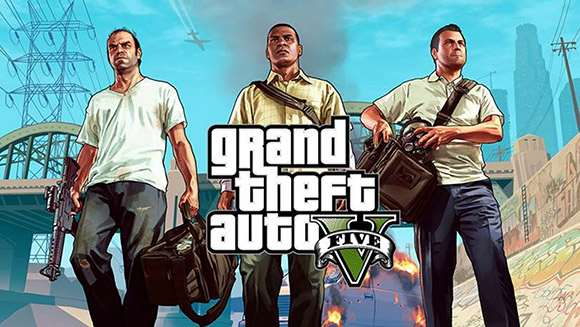

Games
=====

With PlayStation being the bestselling gaming console there is also a plethora
of games released for the multiple consoles that they have released over the years.
With many games released exclusively for PlayStation there has been an endless
supply of new games. With the latest PS4 they have been able to add an internal
store on the device that allows you to also download many free games along with
the many major titles.  

Top Games for each PlayStation Consoles
---------------------------------------

PlayStation
~~~~~~~~~~~

* *Gran Turismo* has sold over 10.85 million copies on PS1.
* Released 1997

.. figure:: gt1.jpg
   :width: 50%

   Image is from the `Amazon page <https://www.amazon.com/Gran-Turismo-playstation/dp/B00000DMAU>`_ 
   to buy this game.

PlayStation 2
~~~~~~~~~~~~~

* *Grand Theft Auto: San Andreas* sold 17.33 million copies on PS2.
* Released 2004

.. figure:: gta_sa.jpg
	:width: 100%

	This image is from the `YouTube <https://www.youtube.com/watch?v=iatwtB6-kHA>`_ 
	video on the Trailer for this game.

PlayStation 3
~~~~~~~~~~~~~

* *Gran Turismo 5* took back the most sold game for PS3 with 11.94 million copies.
* Released 2010

.. figure:: gt5.jpg
	:width: 50%

	Image from `Wikipedia <https://en.wikipedia.org/wiki/Gran_Turismo_5>`_ page on GT5.

PlayStation 4
~~~~~~~~~~~~~

* Once again *Grand Theft Auto V* took the number one spot with over 90 million copies
  sold, however, not all of these were sold on PS4.
* Released 2013

	Image from `guinness world records <http://www.guinnessworldrecords.com/news/2013/10/confirmed-grand-theft-auto-breaks-six-sales-world-records-51900>`_ 
	page for most sold game.

Other Best Selling Games
------------------------

* *FIFA 18*
   * Released 2017
* *God of War*
   * Released 2018
* *The Last of Us Remastered*
   * Released 2014
* *Detroit: Become Human*
   * Released 2018
