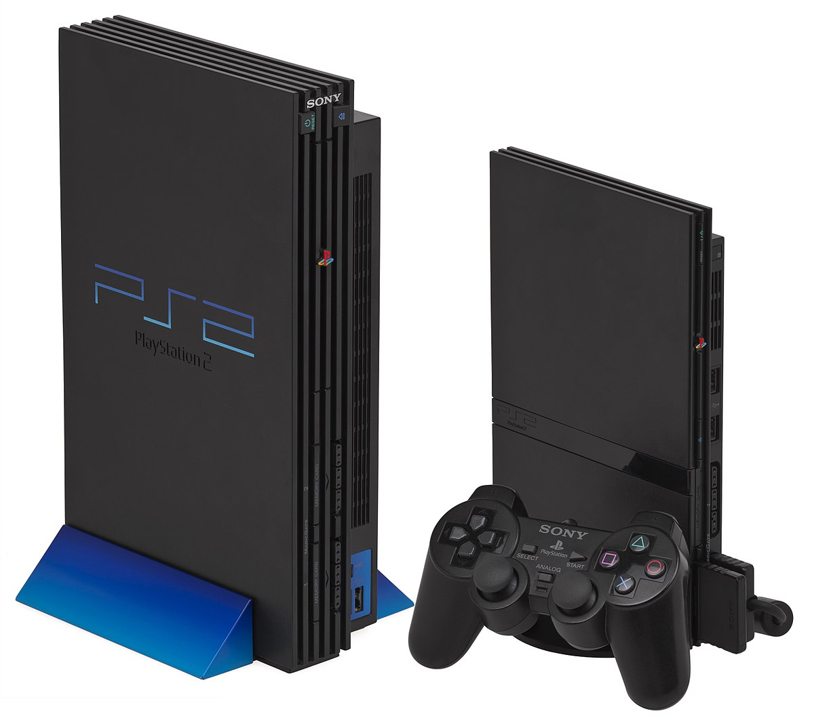

History
=======

The PlayStation has been around since the first installment of it the PS1 in 1994.
Since this start they have made 3 major additions with the latest being the PS4, 
which was released in 2013 and has had a few refreshes since this release. Along 
with these main gaming consoles they also released a portable version of their console
called the PSP which released in 2005. With a history as long as Playstation's 
there is a lot to learn about this console that is now a household name and owned
by millions. 

PlayStation 1
-------------

As I mentioned before the PS1 came out December of 1994 and changed the gaming 
industry forever. This started a trend of owning your own gaming consoles and this
trend has grown to the extent where almost every household owns at least some kind 
of gaming console. 

.. figure:: ps1_pic.jpg
	:width: 100%

	Picture is public domain found from the wikipedia page on
	`ps1. <https://en.wikipedia.org/wiki/PlayStation_(console)#/media/File:PSX-Console-wController.jpg>`_

PlayStation 2
-------------

The PS2 came out in 2000 and was instantly a big competitor to many of the other
consoles being released during the time. It was also the best selling console ever
having sold over 155 million units world wide. 

	This image came from the Wikipedia page on the 
	`PS2. <https://en.wikipedia.org/wiki/PlayStation_2#/media/File:PS2-Versions.jpg>`_

PlayStation Portable
--------------------

Unlike previous consoles in the PlayStation series the PSP was a portable version
of their gaming consoles which primarily competed with the widely popular Nintendo
DS. It released in 2004 and became the most powerful portable system on release
making it the only real competitor to the Nintendo DS which had been dominating 
hand-held game console market. 

.. figure:: psp_pic.png
	:width: 100%

	Image for the PSP is from
	`lifewire. <https://www.lifewire.com/things-to-do-with-psp-2792818>`_

PlayStation 3
-------------

Another 6 years after the PS2 came out Sony released the PlayStation 3 as the 3rd
installment of their console and like the previous two it soled by the millions.
Unlike the previous PlayStations the PS3 had 2 revives after the initial release.
The first reinstatement came in 2009 and was the PS3 Slim, 3 years after that they
released the PS3 Super Slim. 

.. figure:: ps3_pic.jpg
	:width: 100%

	This image came from the Wikipedia page on the
	`PS3. <https://en.wikipedia.org/wiki/PlayStation_3#/media/File:Sony-PlayStation-3-2001A-wController-L.jpg>`_

PlayStation 4
-------------

The latest installment of the PlayStation series is the PS4 which was released
in 2013. With this being the latest version of the series it is also by far the 
most powerful. after its initial release date there have been two major revisions 
of the console with the PlayStation 4 Slim and then the PlayStation 4 Pro coming 
out in 2016. 

.. figure:: ps4_pic.jpg
	:width: 100% 

	Image from `Gamespot <https://www.gamespot.com/articles/ps4-vs-ps4-pro-vs-ps4-slim-what-are-the-difference/1100-6456440/>`_ 
	page on PS4.

Time Table
----------

======================== =================
Version                  Release Year
======================== =================
PlayStation              1994
PlayStation one          2000
PlayStation 2            2000
PlayStation 2 Slimline   2004
PlayStation Portable     2004
PlayStation 3            2006
PlayStation 3 Slim       2009
PlayStation 3 Super Slim 2012
PlayStation 4            2013
PlayStation 4 Slim       2016
PlayStation 4 Pro        2016
======================== =================

