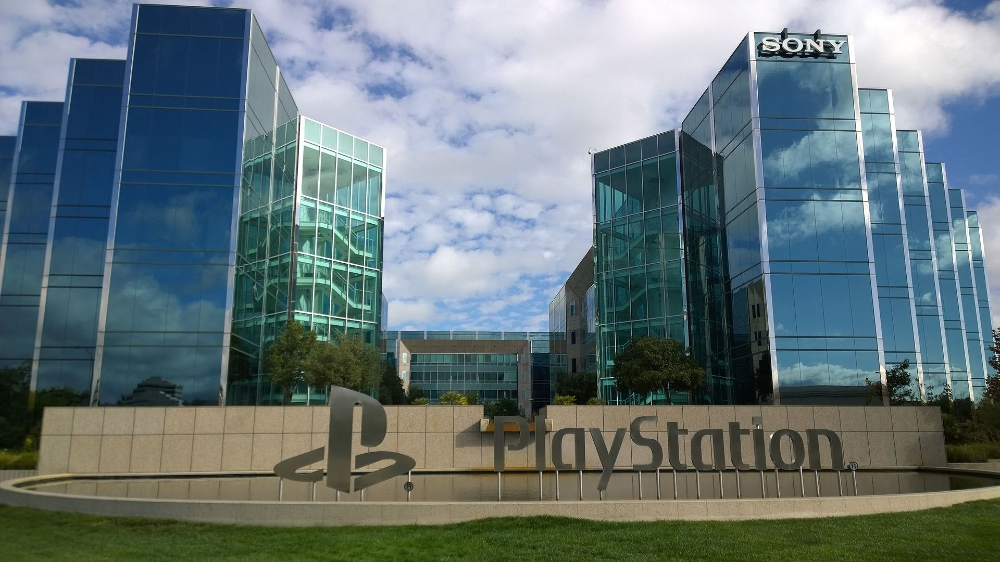

Platform
========

The PlayStation Consoles are sold from the a subsidiary of Sony called
Sony Interactive Entertainment formerly known as Sony Computer Entertainment, and
has been around since 1993. 

History
-------

Founded November 16, 1993 in Minato, Tokyo, Japan Sony Computer Entertainment
specialized in video game consoles and hand-held consoles as well as any accessories
needed for these consoles. SIE now has its headquarters in San Mateo, California
while still being a subsidiary of Sony Corporation. The President and CEO of SIE 
is John Kodera while in total there are roughly 8,000 employees.  

Links
-----

To find more information about `Sony Corporation <https://www.sony.net>`_ or its 
subsidiary `Sony Interactive Entertainment <https://.playstation.com/en-us/>`_ 
follow the links.

