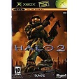
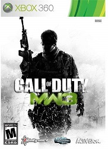
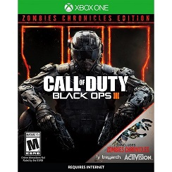

Games
=====

Halo 2
------

   Halo 2 for the Xbox - from: https://images.lukiegames.com/t_300e2/assets/images/XBOX/xbox_halo_2-110214.jpg

   Halo 2 was released on November 9, 2004 and was the Xbox's best-selling game with 6.3 million sold in the United States and 8 million sold worldwide. Halo 2 is a first-person shooter game developed by Bungie and is the 2nd installment of the Halo franchise. One reason for its popularity was the multiplayer mode on Xbox Live. 

Call of Duty: Modern Warfare 3
------------------------------

   Call of Duty: MW3 for the Xbox 360 - from: https://images-na.ssl-images-amazon.com/images/I/51RCmHiPWXL._AC_SX430_.jpg

   Call of Duty: Modern Warfare 3 was released on November 8, 2011 and the Xbox 360's best-selling game with 14.23 million copies sold worldwide. Call of Duty MW3 is a first-person shooter game developed by Infinity Ward and Sledgehammer Games and is published by Activision. It is the eight installment of the Call of Duty franchise and the third installment of the Modern Warfare story line.

Call of Duty: Black Ops III
---------------------------

   Call of Duty BO3 for the Xbox One - from: https://target.scene7.com/is/image/Target/GUEST_52976d4c-8a22-4001-92e0-428b4290beac?wid=488&hei=488&fmt=pjpeg

   Call of Duty: Black Ops 3 was released on November 6, 2015 and was the Xbox One's best-selling game as of 2016 with 7.24 million copies sold. Call of Duty: Black Ops 3 is a first-person shooter game developed by Trayarch and published by Activision. It is the twelfth installment in the Call of Duty franchise and the third installment of the Black Ops story line.

