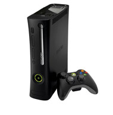

History
=======

Xbox
----

.. figure:: xbox.png
   :width: 50%

   Original Xbox - from: https://i.redd.it/4yh420ju96yz.jpg

   The original Xbox was released on November 15, 2001, and was apart of the 6th generation of video game consoles along with PlayStation 2, the GameCube, and Sega's Dreamcast. At release, the console was priced at $299.99 which is the equivalent to $414.61 in 2017. The Xbox was integrated with Xbox Live service which allowed players to connect with other players to play games online either with or without a broadband connection. Xbox Live was more successful than Dreamcast's online service as well as PlayStation 2's online service due to features like the buddy list and better performing servers.

Xbox 360
--------

   Xbox 360 - from: https://www.gamestop.com/common/images/lbox/909208b.jpg

   The Xbox 360 released on November 22, 2005, and was apart of the 7th generation of video game consoles along with PlayStation 3 and the Nintendo Wii. The 360 was the first console released of the 7th generation and had a release price of $399.99. The 360 was the first console to natively render games in HD.

Xbox One
--------

.. figure:: xboxone.png
   :width: 50%

   Xbox One - from: https://img-prod-cms-rt-microsoft-com.akamaized.net

   The Xbox One released on November 22, 2013 and was apart of the 8th generation of video game consoles along with PlayStation 4, the Wii U and the Nintendo Switch. The Xbox One released at a price of $499.99. New features included the ability to pass television programming from a set-top box over HDMI, use a built-in electronic program guide, the ability to multitask by snapping applications, ability to automatically record and save highlights of gameplay, and a controller with impulse triggers.

